# PDCCH allocator

## Общее описание

Есть DCI. С помощью DCI eNB командует, где UE передаёт информацию и где принимает (т.е. определяет распределение ресурсов для каналов PDSCH и PUSCH):
   - userdata в UL и DL
   - отправка RAR базовой станцией
   - отправка Msg3 UE
   - Paging
   - Broadcast

DCI передаются в канале PDCCH. DCI может занимать разное число CCE в зависимости от Aggregation level. UE декодирует не весь PDCCH, а только определенные его части, определенные через Search Space. Существуют Common Search Space (который декодируют все UE), и UE-specific Search Space (для отдельной UE).

Каждая DCI может занимать не любое место в канале PDCCH, а только из своего search space и на своём aggregation level (L1, L2, L4, L8). Search spase’ы у разных DCI могут пересекаться.

Search spaces для двух UE:

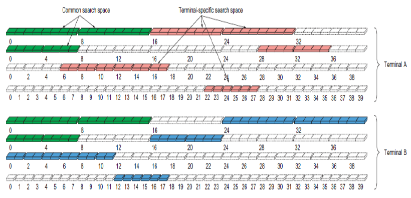

Здесь по горизонтали для каждой UE пронумерованы CCE с разметкой по Aggregation level. Номер Aggregation Level указывает, сколько CCE нужно для кодирования одного DCI.
С учётом этих данных, PDCCH allocator выделяет место для DCI в канале PDCCH так, чтобы получилось разместить наибольшее их количество. 

Shuffling allocator пытается разместить DCI начиная с случайного места из её search space, далее идёт по всему search space подряд, а когда не получается, пробует переставить все мешающие DCI для размещения данной.

## Обоснование
Для сравнения использовалось два других алгоритма:
- Перебор дерева решений. Перебор всех возможных вариантов размещения всех DCI и выбор лучшего. Такой алгоритм гарантированно даёт лучшую утилизацию CCE и низкую вероятность блокировки, но работает слишком медленно.
-  Последовательный. Пытается разместить DCI начиная с случайного места из её search space, далее перебирает весь search space подряд. Такой алгоритм показал высокую скорость, но плохую утилизацию CCE и высокую вероятность блокировки.

Из полученных данных (см. Приложение 1) видно, что при схожей вероятности блокировки алгоритм с перестановками показывает значительно лучшее время, чем перебор дерева решений. При этом время его работы не сильно выше последовательного, при лучшей утилизации CCE.

## Описание входных и выходных параметров

#### Конфигурация PDCCH allocator

Устанавливается cell_config, ширина канала в PRB. На основании cell_config расчитывается count_table, создаётся объект структуры PdcchSched.

#### Входные параметры

Информация о DCI:
- aggregation level
- search_space
- rnti

#### Выходные параметры

- Список всех размещённых DCI
- total_mask
- CFI

## Алгоритмы и их назначение
Аллокация DCI

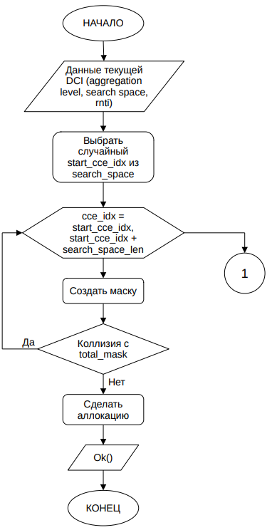

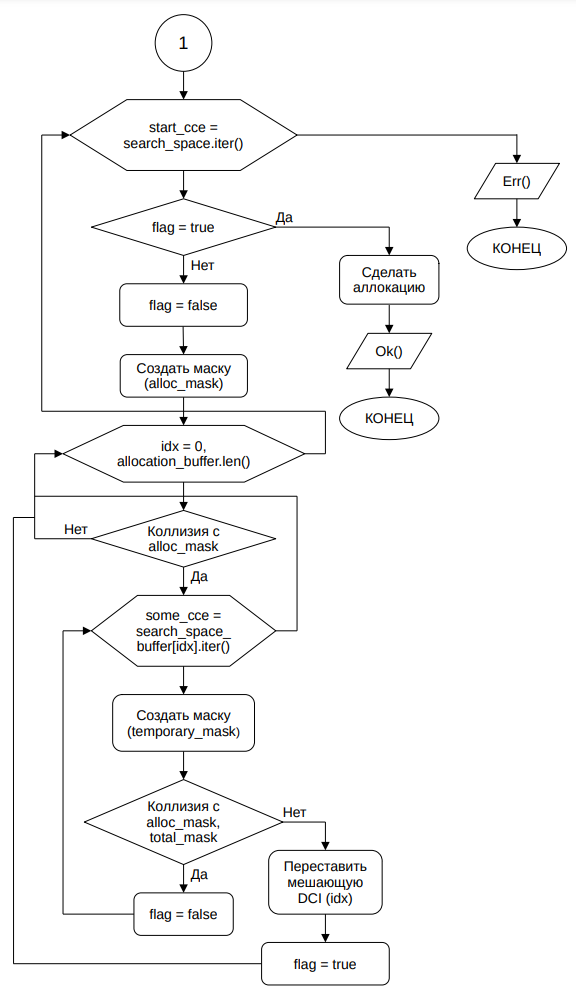

### Приложение 1

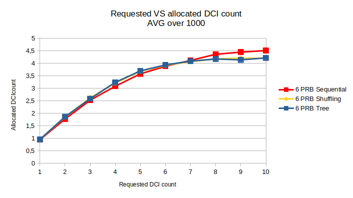

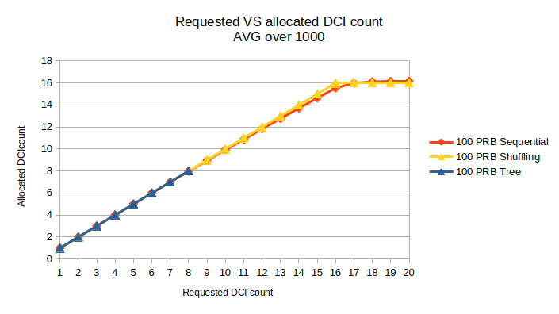

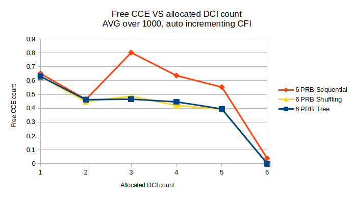

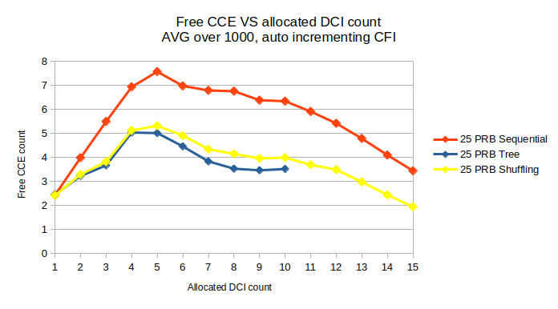

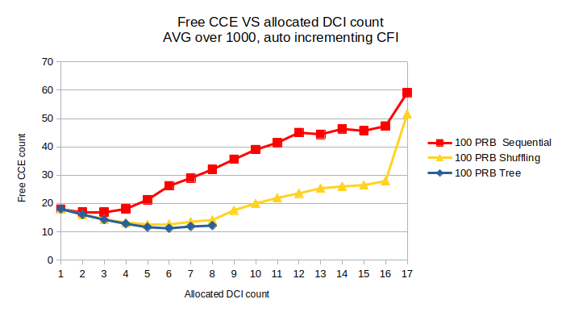

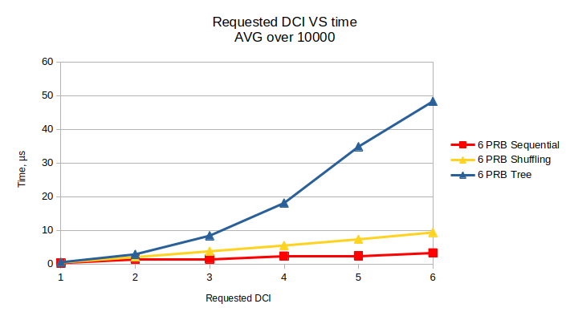

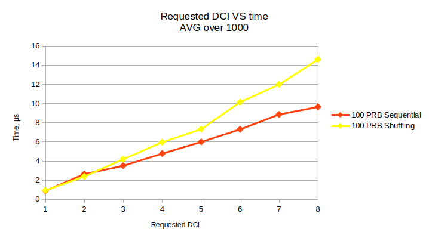

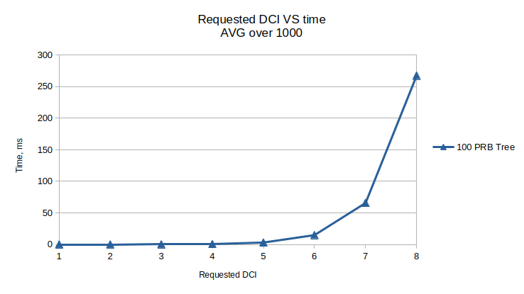
